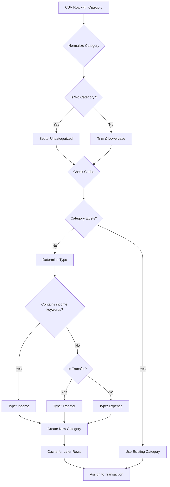

# Category Import Fix - Summary

## Problem Identified

The CSV import was not properly detecting and assigning categories because:

1. **"No Category" not recognized**: Rows with "No Category" in the CSV weren't mapped to "Uncategorized" in the database
2. **Missing custom categories**: Many category names in the CSV (e.g., "Fast Food", "Gasoline", "Electronics") didn't exist in the system categories
3. **Case-sensitive matching**: Category matching was case-sensitive, causing mismatches

## Categories Found in example.csv

27 unique categories were found in the CSV:
- Admission & Tickets
- Beer, Wine & Spirits  
- Books & Magazines
- Cable & Internet
- Clothing
- Coffee Shop
- Dentist
- Doctor
- Electronics
- Fast Food
- Gasoline
- Gifts
- Groceries
- Hair
- Hobbies
- Home Supplies
- Membership
- Movies & Music
- **No Category** ← Problem category
- Other
- Paycheck
- Personal Care Products
- Pharmacy
- Restaurants
- Shipping
- Tax
- Transfer

## Solution Implemented

Updated [`app/api/import/process/route.ts`](../app/api/import/process/route.ts) with the following enhancements:

### 1. Normalize "No Category"
```typescript
if (categoryValue.toLowerCase() === 'no category') {
  categoryValue = 'Uncategorized';
}
```

### 2. Case-Insensitive Matching
```typescript
const normalizedCategory = categoryValue.toLowerCase().trim();
let matchedCategoryId = categoryMap.get(normalizedCategory);
```

### 3. Auto-Create Custom Categories
When a category from the CSV doesn't exist in the database:
- Automatically creates a new custom category for the user
- Intelligently determines category type:
  - **Income**: For keywords like "paycheck", "salary", or positive amounts
  - **Transfer**: For keywords like "transfer"
  - **Expense**: Default for all other categories
- Caches the new category ID for subsequent rows in the same import

### 4. Enhanced Error Handling
- Logs when new categories are created
- Continues processing even if category creation fails
- Falls back to "Uncategorized" if needed

## How It Works



## Benefits

1. **Automatic Category Creation**: No manual intervention needed for new categories
2. **Better User Experience**: Categories are preserved from the CSV exactly as the user named them
3. **Resilient Matching**: Handles case variations and whitespace
4. **Smart Type Detection**: Automatically categorizes income vs expenses
5. **Performance**: Caches created categories to avoid duplicate creation within the same import

## Testing

To test the fix:

1. Start your development server
2. Navigate to the import page
3. Upload `example.csv`
4. Verify that:
   - All 290 rows are imported successfully
   - "No Category" rows are assigned to "Uncategorized"
   - Custom categories are created for unmatched names
   - Categories match the CSV exactly

## Future Enhancements (Optional)

### Category Mapping/Aliasing Feature

For future imports, consider adding a category mapping system:

**Database Table: `category_aliases`**
```sql
CREATE TABLE category_aliases (
  id uuid PRIMARY KEY DEFAULT gen_random_uuid(),
  user_id uuid NOT NULL REFERENCES auth.users(id),
  csv_name text NOT NULL,
  category_id uuid NOT NULL REFERENCES categories(id),
  auto_apply boolean DEFAULT true,
  created_at timestamptz DEFAULT now(),
  UNIQUE(user_id, csv_name)
);
```

**Benefits:**
- Users can map CSV categories to existing system categories
- Example: "Fast Food" → "Dining & Restaurants"
- Example: "Gasoline" → "Gas & Fuel"
- Reusable across imports
- Can be configured per user

**UI Flow:**
1. During import, show a mapping screen for unmatched categories
2. User can choose to:
   - Create a new category (current behavior)
   - Map to an existing category
   - Set as default for future imports
3. Mappings are saved and auto-applied next time

## Related Files

- [`app/api/import/process/route.ts`](../app/api/import/process/route.ts) - Main import logic
- [`lib/utils/csv-parser.ts`](../lib/utils/csv-parser.ts) - CSV parsing utilities
- [`supabase/migrations/20251216172210_initial_schema.sql`](../supabase/migrations/20251216172210_initial_schema.sql) - Database schema

## System Categories Reference

Current system categories in the database:
- **Income**: Salary, Investment Income, Refunds, Other Income
- **Expense**: Groceries, Dining & Restaurants, Transportation, Gas & Fuel, Entertainment, Shopping, Healthcare, Insurance, Utilities, Rent & Mortgage, Phone & Internet, Subscriptions, Fitness & Gym, Travel, Education, Personal Care, Gifts & Donations, Bills & Payments, Uncategorized
- **Transfer**: Transfer
