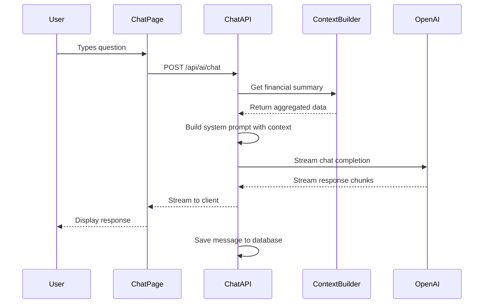

# LLM Financial Assistant Integration Plan

## Overview
Integrate an AI-powered financial assistant that can analyze your transaction data and provide personalized financial guidance. The assistant will have access to your monthly/yearly financial summaries, spending patterns, recurring charges, and bills.

## Key Features
1. **Chat Interface** - Dedicated page for conversations with AI about finances
2. **Conversation History** - View and continue previous conversations
3. **Context Window Management** - Efficient handling of conversation length limits
4. **Model Flexibility** - Switch between GPT models in settings
5. **Financial Context** - AI has access to aggregated financial data (not raw transactions)

## Architecture

```mermaid
flowchart TB
    subgraph Frontend
        UI[AI Chat Page]
        Settings[Settings Page]
        ConvList[Conversation List]
    end

    subgraph API Routes
        ChatAPI[/api/ai/chat]
        ConvAPI[/api/ai/conversations]
        SummaryAPI[/api/ai/financial-summary]
    end

    subgraph AI Layer
        OpenAIClient[OpenAI Client]
        ContextBuilder[Financial Context Builder]
        SystemPrompt[System Prompts]
    end

    subgraph Database
        Conversations[ai_conversations]
        Messages[ai_messages]
        UserSettings[user_settings]
        FinancialViews[Financial Summary Views]
    end

    subgraph Existing Data
        Transactions[(transactions)]
        Categories[(categories)]
        RecurringSeries[(recurring_series)]
        Bills[(bills)]
    end

    UI --> ChatAPI
    UI --> ConvAPI
    Settings --> UserSettings
    ConvList --> ConvAPI
    
    ChatAPI --> OpenAIClient
    ChatAPI --> ContextBuilder
    ChatAPI --> Conversations
    ChatAPI --> Messages
    
    OpenAIClient --> SystemPrompt
    ContextBuilder --> FinancialViews
    ContextBuilder --> SummaryAPI
    
    FinancialViews --> Transactions
    FinancialViews --> Categories
    FinancialViews --> RecurringSeries
    FinancialViews --> Bills
```

## Database Schema

### New Tables

#### user_ai_preferences
Stores user AI preferences (API key via environment variable).
```sql
- id: uuid PRIMARY KEY
- user_id: uuid REFERENCES auth.users
- preferred_model: text DEFAULT 'gpt-4o-mini'
- created_at: timestamptz
- updated_at: timestamptz
```

#### ai_conversations
Stores conversation metadata.
```sql
- id: uuid PRIMARY KEY
- user_id: uuid REFERENCES auth.users
- title: text
- context_type: enum [monthly, yearly, custom]
- context_date_start: date
- context_date_end: date
- message_count: integer DEFAULT 0
- total_tokens: integer DEFAULT 0
- created_at: timestamptz
- updated_at: timestamptz
```

#### ai_messages
Stores individual messages within conversations.
```sql
- id: uuid PRIMARY KEY
- conversation_id: uuid REFERENCES ai_conversations
- role: enum [user, assistant, system]
- content: text
- tokens: integer
- model: text
- created_at: timestamptz
```

### New SQL View: financial_summary_view
Pre-aggregated financial data for efficient context building:
- Monthly income/expenses by category
- Top merchants by spending
- Recurring charges summary
- Year-over-year comparisons
- Cash flow trends

## Data Privacy Approach

The AI will receive **aggregated summaries**, not raw transaction descriptions:

**What AI sees:**
- "Groceries: $450 this month (15 transactions)"
- "Monthly subscriptions total: $89.99"
- "Your largest expense category is Dining at $320"

**What AI does NOT see:**
- Individual transaction descriptions
- Specific merchant names (unless you ask about them)
- Bank account details

## Chat Flow



## Model Options

Users can select in settings:
- **gpt-4o-mini** (default) - Fast, cost-effective for most queries
- **gpt-4o** - More capable for complex analysis
- **gpt-4-turbo** - Balance of speed and capability

## Example Questions the AI Can Answer

1. "How much did I spend on dining out this month compared to last month?"
2. "What are my top 5 expense categories this year?"
3. "Do I have any subscriptions I should consider canceling?"
4. "Based on my spending patterns, where could I cut back?"
5. "What's my average monthly grocery spend over the last 6 months?"
6. "Am I on track with my spending this month?"
7. "Show me my income vs expenses trend for this year"

## Security Considerations

1. **API Key Storage** - User's OpenAI API key stored encrypted in database
2. **Row Level Security** - All AI tables have RLS policies for user isolation
3. **Rate Limiting** - Consider implementing rate limits on chat endpoint
4. **Token Limits** - Enforce reasonable token limits per conversation

## Files to Create

### Database Migrations
1. `supabase/migrations/YYYYMMDD_add_ai_tables.sql`

### Library Files
1. `lib/ai/openai-client.ts` - OpenAI SDK configuration
2. `lib/ai/financial-context.ts` - Build context from financial data
3. `lib/ai/system-prompts.ts` - System prompts for financial advisor

### API Routes
1. `app/api/ai/chat/route.ts` - Streaming chat endpoint
2. `app/api/ai/conversations/route.ts` - List conversations
3. `app/api/ai/conversations/[id]/route.ts` - Single conversation ops
4. `app/api/ai/financial-summary/route.ts` - Get financial context

### Components
1. `components/ai/ChatMessage.tsx` - Message bubble component
2. `components/ai/ChatInput.tsx` - Input with send button
3. `components/ai/ConversationList.tsx` - Sidebar with past chats
4. `components/ai/FinancialContextIndicator.tsx` - Shows data scope

### Pages
1. `app/dashboard/ai/page.tsx` - Main AI assistant page

### Updates to Existing Files
1. `app/dashboard/settings/page.tsx` - Add AI settings section
2. `components/dashboard/DashboardNav.tsx` - Add AI link
3. `.env.example` - Add OPENAI_API_KEY placeholder
